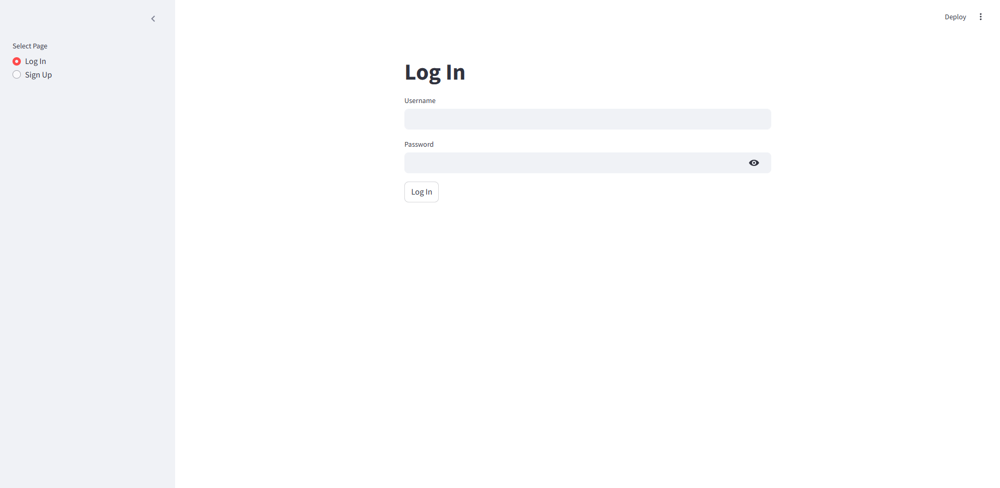
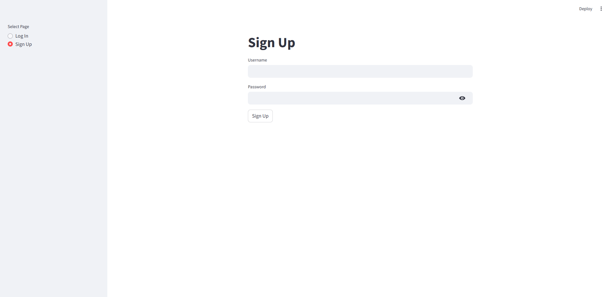
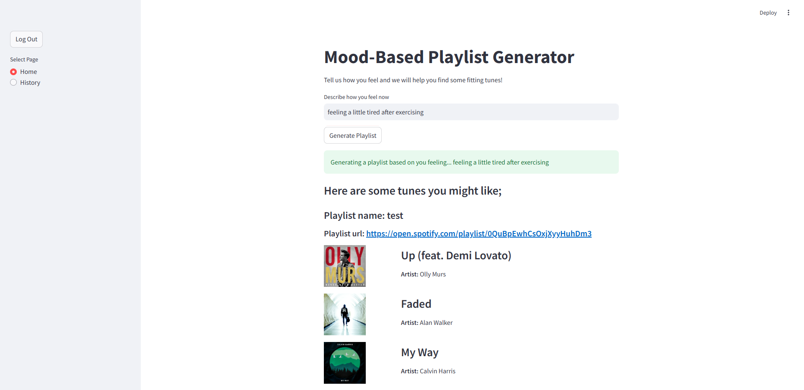
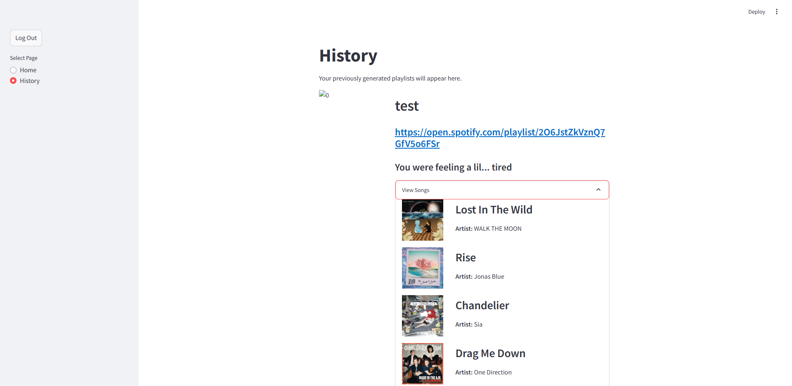

# **🎵 Spotify Song Recommendation Extension**  
A personalized song recommendation system that **analyzes your listening history, mood, and global song trends** to generate custom playlists.

This is a simple personal project where I explore **AI-driven music recommendations** using **Spotify API, FastAPI, and Streamlit** to attempt to improve my understanding of **machine learning, embeddings, and backend development**.

---

## **📌 Available Versions**
| Version | Description |
|---------|------------|
| **v1.0** | MVP: Streamlit UI, SentenceTransformer NLP | 


## **🚀 Features**
- 🎧 **Personalized Music Discovery** – Get recommendations based on your listening habits and mood prompts.  
- 📊 **Latent Space Embeddings** – Maps user input and songs into a shared space for similarity-based recommendations.  
- 🔍 **KNN Similarity Search** – Finds songs that match the user’s mood and listening history.  
- 🌍 **Global Song Trends** – Integrates **Spotify's global top charts** for diverse recommendations.  
- 🔗 **Spotify Integration** – View recommendations in the UI or **save them as a Spotify playlist**.  


## **🛠️ Tech Stack**
| Component        | Technology Used |
|-----------------|----------------|
| **Frontend**    | Streamlit |
| **Backend API** | FastAPI |
| **Database** | PostgreSQL |
| **Spotify Data** | Spotipy API |
| **Additional Song Data** | Last.fm API |
| **ML Embeddings** | Latent Space Representation |
| **Similarity Search** | K-Nearest Neighbors (KNN) |


## **⚙️ How It Works**
1. **User Authentication** 
   - User logs in to web application.
   - User is prompted to connect their spotify account via **Spotify OAuth** and spotify tokens are saved to DB.
   - The spotify **token is refreshed** whenever necessary to make Spotify API calls.
2. **Data Collection**
   - Fetches **top listened songs** from Spotify.
   - Retrieves **global top songs** via Spotify API.
   - Collects **additional metadata** via Last.fm API.
3. **Embedding & Similarity Matching**  
   - User's prompt & songs are **embedded into a latent space**.  
   - The system **adjusts weights** based on the user's **top songs**.  
   - Uses **K-Nearest Neighbors (KNN)** to find songs with **similar mood and characteristics**.  
4. **Playlist Creation & Display**
   - Recommended songs are displayed in the **Streamlit UI**.
   - Playlists are **automatically saved** to the user's Spotify accounts.
   - **Previously created playlists** can be view and linked through History.


## 💬 UI Showcase

### Log in / Sign up 




### Playlist Generator



### Playlist History



## **💡 Work Done & Future Improvements**
### **🛠️ Skills Used**
- **Frontend Development** – Using **Streamlit** to create an interactive UI.  
- **Backend Development** – Using **FastAPI** to handle API requests and data processing.  
- **Machine Learning** – Implementing **vector embeddings and KNN** for recommendation systems.  
- **Spotify API Integration** – Understanding **OAuth authentication, user data retrieval, and playlist management**.  

### **🔮 Next Steps**
- **Improved NLP** – Improve latent representation of user's descriptive prompts.
- **Genre-Based Filtering** – Improve recommendations based on song metadata.  
- **Deep Learning for Embeddings** – Use models like **Word2Vec or Sentence Transformers** for better similarity matching.  
- **Real-time Audio Analysis** – Implement features for **analyzing lyrics or song audio**.  


## **📌 Setup & Installation**
### **1️⃣ Clone the repository**
```bash
git clone https://github.com/gerardlke/spotify-extension.git
cd spotify-extension
```

### **2️⃣ Install Dependencies**
```bash
pip install -r backend/requirements.txt
pip install -r frontend/requirements.txt
```

### **3️⃣ Set up Database**
- Install PostgreSQL.
- Run and instance and update the .env with the Database details.

### **4️⃣ Set up Spotify API Credentials**
- Create a **Spotify Developer App** at https://developer.spotify.com/dashboard.
- Obtain **Client ID & Secret**.  
- Set up **redirect URI** for authentication.
- Edit **.env** file with new client ID & Secret.

### **5️⃣ Run the Application**
- Run **backend.bat** & **frontend.bat**.
- Wait for backend script to start up.